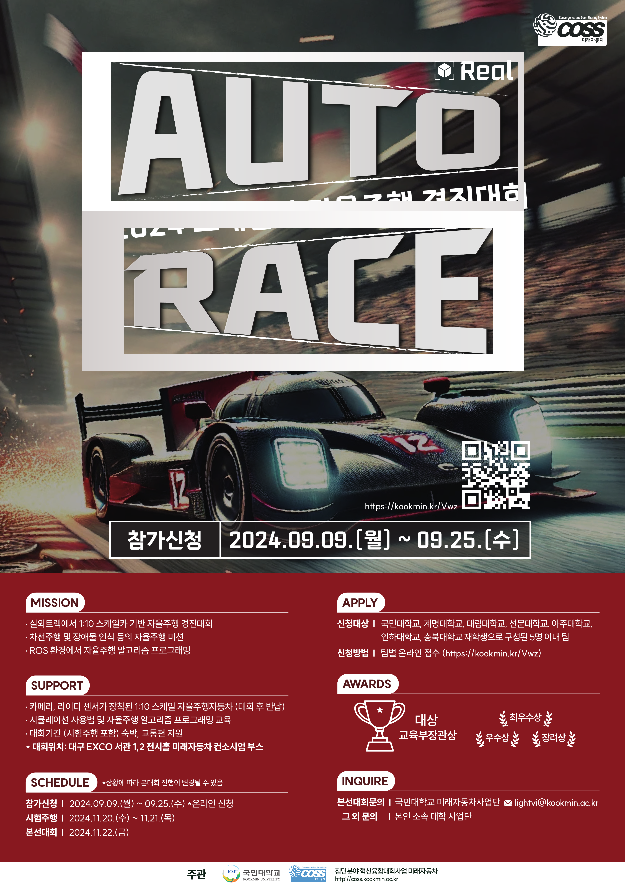

# 🏎️ AutoRace 2024 스케일카 자율주행 경진대회

---

## 📄 대회 포스터

---

## 🏆 대회 결과
- **최종 순위:** 🥇 **1등** (**교육부장관상 수상**)

---

## 🔧 업로드 및 담당 내용
제가 **직접 구현 및 담당한 부분**만 업로드하였습니다.

### 📌 구현 미션
| **미션 번호** | **설명** | **적용 기술 및 특징** |
|--------------|----------|-----------------------|
| **미션 1** | 라바콘 회피 주행 | 차선 인식 대신 **LiDAR 기반 경로 계획 알고리즘** 적용 |
| **미션 6** | 터널 구간 주행 | **암실 상황**에서도 주행 가능하도록 LiDAR 기반 제어 적용 |
| **미션 7** | 차선 변경 주행 | 미션 6 구간 앞 **마커 인식** → 경로 A/B 선택 후 주행 |

---

## 🎥 주행 영상

